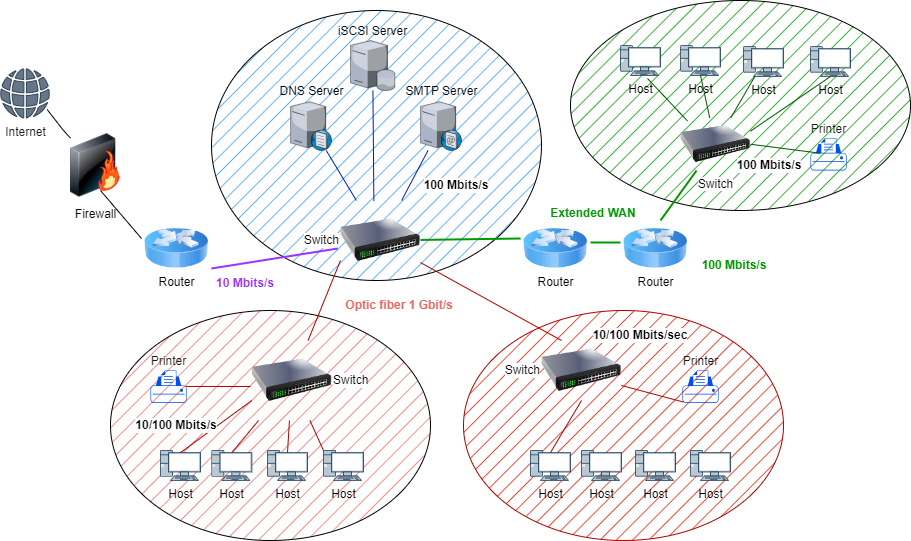

# Project: Secure Network Design

### Establish a network plan
* Team Challenge
* Deadline - 7 days

 

**Project Context:**

Your company faces an exciting challenge: designing a secure and efficient network for a client relocating to a new office. Their current setup requires modernization, and you're tasked with crafting a cost-effective, well-structured plan that optimizes resource allocation while adhering to stringent security best practices.

**Requirements**

* **Network Simulation:** We'll leverage gns3 to visualize and test our network design. If your PC/Laptop does not support gns33 you can use Packet Tracer.
* **Structured Documentation:** Clear and comprehensive documentation will accompany the network plan, ensuring future maintainability.
* **Security Focus:** Security considerations will be prioritized throughout the design process, implementing robust measures to protect network assets.
* **Justified Design:** Our presentation will present our design choices and explain their rationale, demonstrating critical thinking and understanding.

**Evaluation Criteria:**

* **Network Functionality:** Does the Packet Tracer simulation demonstrate robust connectivity and performance?
* **Documentation Clarity:** Is the network documentation thorough, understandable, and well-structured?
* **Security Strength:** Have appropriate security measures been implemented to address potential threats?

**Deliverables:**

* **gns3 Network:** Share your network configuration file for evaluation.
* **Comprehensive Documentation:** Create a detailed PDF document describing the network design, including:
    * Network diagram with annotations.
    * IP addressing table per sector and VLAN (if used).
    * Configuration details for key devices.
    * Explanation of security measures and their purpose.
    * Cost breakdown (as per available online information, no need to ask for quotes) of network components.

* **Group Presentation:** Deliver a 10-minute presentation explaining your design choices and security considerations. Ensure all team members participate.

**Constraints and Requirements:**

* **Firewall Simulation:** While Packet Tracer may not fully support advanced firewall configuration, we'll implement alternative security measures (explained later).
* **Client Requirements:**

    * DNS server
    * DHCP server
    * DMZ concept implemented through VLANs and access control lists (ACLs) (firewall alternative)
    * iSCSI storage server
    * Four network sectors:
        * Management/Secretariat (5 workstations)
        * Study (8 workstations)
        * Production (10 workstations)
        * Support (2 sectors, 10 workstations each)

**Guidelines:**

* **Scalability and Manageability:** Design a network that can accommodate future growth without compromising efficiency.
* **Resource Optimization:** Allocate resources strategically, considering costs and future needs.
* **Clear Documentation:** Document IP addressing, VLANs (if used), and device configurations meticulously.
* **Robust Security:** Implement measures like ACLs, strong passwords, and encryption (where applicable).
* **Cost-Effectiveness:** Make budget-conscious choices in equipment selection and configuration.

### RADIUS Server in gns3 

* Resources for reference - [Part 1](https://youtu.be/Yr0PGonzbNs?si=k31zz3-YECv81dnl) and [Part 2](https://youtu.be/Yr0PGonzbNs?si=k31zz3-YECv81dnl)

* **Centralized authentication:** RADIUS (Remote Authentication Dial-In User Service) is a networking protocol that centralizes authentication for network access. User credentials are stored on a dedicated RADIUS server, not on individual network devices.
* **Client-server model:** RADIUS operates using a client-server model. When a user attempts to access a network resource (like a router or VPN), the network device (RADIUS client) sends the user's credentials to the central RADIUS server for verification.
* **Enhanced security:**
    * Reduced risk of credential compromise if a network device is compromised.
    * Stronger password policies can be enforced by the RADIUS server.
    * Centralized management of user accounts and permissions.

