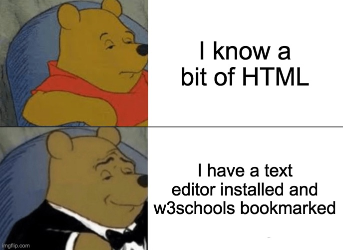

# Let's go Phishing

- Challenge Type : solo
- Duration : 1 days

## How to start ?

As you have seen, there are different types of phishing, however, many of them are based on the reproduction of a web document, to do this we will see what languages are used to reproduce this type of technique.

### HTML

#### What is HTML

When we inspect the source code of a web document, the first language we can observe is called HTML (HyperText Markup Language), it is a markup language that is used to establish the structure of the document.

#### Practice

- https://www.codecademy.com/courses/learn-html/lessons/intro-to-html/exercises/intro

### CSS

#### What is CSS

Apart from the content, there is also the visual, for this we will use CSS (Cascading Style Sheets), it is with this language that we will modify the appearance of a document.

#### Practice

- https://www.codecademy.com/courses/learn-css/lessons/learn-css-setup-and-syntax/exercises/intro-to-css

## Challenge

- Bob has a dog (a bull terrier) named "Shimi". Bob really loves his dog. 
- Alice is a fan of Mécanique. She has two vintage cars and often likes to parade around with her ancestral objects.
- Your mission will be to obtain Alice's or Bob's password

## Resources

- [MDN HTML](https://developer.mozilla.org/en-US/docs/Learn/HTML)
- [MDM Form](https://developer.mozilla.org/en-US/docs/Web/HTML/Element/form)
- [MDN CSS](https://developer.mozilla.org/en-US/docs/Learn/CSS)
- [Cheatsheet Html](https://learnxinyminutes.com/docs/html/)
- [Cheatsheet CSS](https://learnxinyminutes.com/docs/css/)

## Hint
- [Webhook](https://webhook.site/)
- [Ngrok](https://ngrok.com/)
