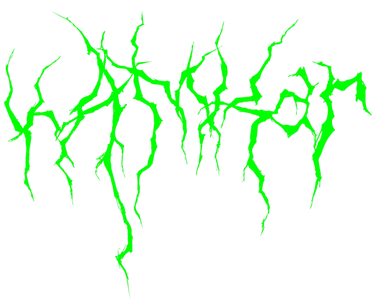

# Kamkar4

  

##  Course Overview 

The course's main purpose is to _bridge the gap_ between curious and solution oriented _individuals_ and _companies_ in need of capable people. It is to provide the most fundamental knowledge to the students so that they can understand what cyber security is. Due to limited time, we will try to eliminate theoretic proofs and formal notations as far as possible, so that the students can get the full picture of cyber security easily.

Note: The ultimate goal is the mindset, not specific tools. For that reason the timeline above may vary during the course and the tech mentioned might be replaced by others or not seen at all.
                                                |                                            |
## 🌊 How to thrive at BeCode?

Read the following documents:

1. Read the **Pedagogical Contract** in

   - [English](https://github.com/becodeorg/BeCode/blob/master/educationalcontract.md)
   - [French](https://github.com/becodeorg/BeCode/blob/master/contratpedagogique.md)

2. If you need a refresher, here is the presentation about [the rules](https://docs.google.com/presentation/d/1EC4yH95XNA1-nVaOrFkxQ2Z2nTZxGs_gd-NPq6Rngk4/edit?usp=sharing)

Your contacts at BeCode:

1. Your lead tech coaches: [Sananda Mitra](sananda.mitra@becode.org) , [Mathias Bochet](mathias.bochet@becode.org)
2. Your professional referent: [Eric "The wise" Salla](eric@becode.org)

## 🕑 Respect for planning: being late & absence

In case of **delay**, **absence** or **early leave** (planned or not), you will need to warn us.

In short here is what you do in any of the three cases above:

1. Send a message to _all_ your coach(es) by mail (and perhaps Discord too)
2. Warn BeCode through [moodle.becode.org](https://moodle.becode.org/):
   - If you already have some note to justify your absence (eg. a doctor's note), then send this straight to us using the platform.
   - If you know that you are going to obtain such document, tell us when you notify us of your absence. Once you have the document, send it to us through the platform.
   - When you know that you will have no legal reason for the absence or delay then please let us know <abbr title="As Soon As Possible">ASAP</abbr> as well on Discord. Not showing up or showing up late is considered unprofessional.

## Reminder

- 2 unjustified occasions of being late or leaving early is seen as an absence
- 2 unjustified absences leads to a one-on-one conversation
- 6 unjustified absences leads to a termination of your contract with us {and the vdab} and results in you leaving this training permanently.
- If the absence rate (justified or not) exceeds 20%, BeCode may decide on the final exclusion of the learner.

## 📅 Agenda

To keep up to date with the upcoming events, workshops and hackathons remember to check the **Discord channels**!

## 🌴 Course Duration, Vacation and holidays

Starts on 20/05/2025 - Ends on 05/12/2025

There are 2 vacation blocks during the training:

👇

| Dates            | What are we doing? |
| ---------------- | ------------------ |
| 21/07 -  25/07   | Planned vacation   |
| 20/10 -  24/10   | Planned vacation   |

All **National Holidays** will be respected as well.

## Course content

BeCode promotes a learning experience based on _projects rather than lessons_.
With that in mind this course content has been divided in multiple categories of
challenges, resources and other tools aiming to teach specific sets of skills.

Please find the overview of the course [here](./assets/outline.png).

## Target skills

With an ever-growing and changing set of _things to know_ we made choices so
that, by the end of the training, the learner will have acquired the following
technical foundations and soft skills.

### Tech skills

By the end of the common trunk, trainees should have acquired a good infrastructure affinity, good coding background (with good practices and
secure coding) and the fundamentals of cyber security, allowing them to continue
learning on their own and in the work place.

More specifically:

- Able to deconstruct falsehood.
- General knowledge, competences and good practices.
- Able to understand modern tools and techniques.

### Soft skills

- Continuous Learner: Eager to learn, professional learner.
- Team Player: Helps, asks for help, takes its share of the collective load, gives and takes constructive feedback.
- Reliable: Trustworthy, committed, punctual.
- Change Enthusiast: Flexible, solution mindset.

### Careers

With this training, our learners should be able to pursue the following career paths, to continue learning while acquiring battlefield experience:

- Cyber Security Analyst
- Incident Responder 
- Junior Pentester 
- GRC specialist
- Cloud Security specialist

BeCode helps graduates find an internship, hopefully converting into a job that they like, and at the same time, help partner companies staff up with our autonomous, eager to learn and reliable talents. But 3 months prior to the end of the training it is highly encouraged that the learners start applying to the job market.

